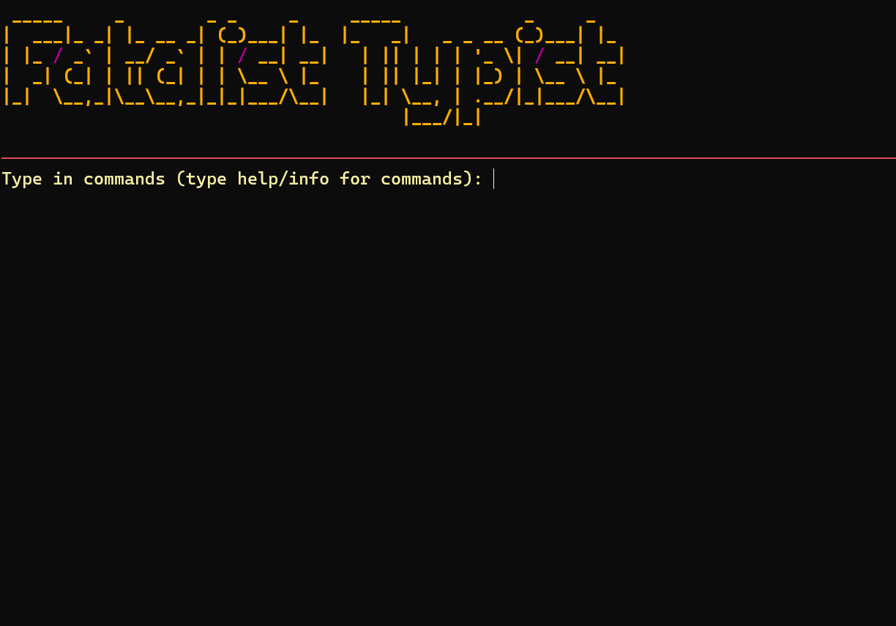
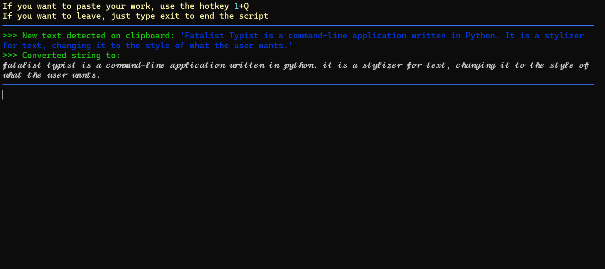

# Fatalist Typist
### Version 1.0

Fatalist Typist is a command-line application written in Python. It is a stylizer for text, changing it to the style of what the user wants. Some that are made for the sake of making it for the workaround of the user. You can also use it to make your messages pop, without the use of an online service.

## Features

### Change style of text
*   Free of decision of choosing which style you want to start before starting the program
*   Once the program begins, your recent text gets converted into text re-fashioned to what style you selected
*   Copy any text, and see the program convert the selected text in the preview.

### Conversion of text
*   For every instance of highlighted text, it gets converted based on what setting you selected.
*   You can copy the text, and paste it as your new text or message for your own purpose.

## Customization

*   **Font style** - Change the style of the text before the program begins.